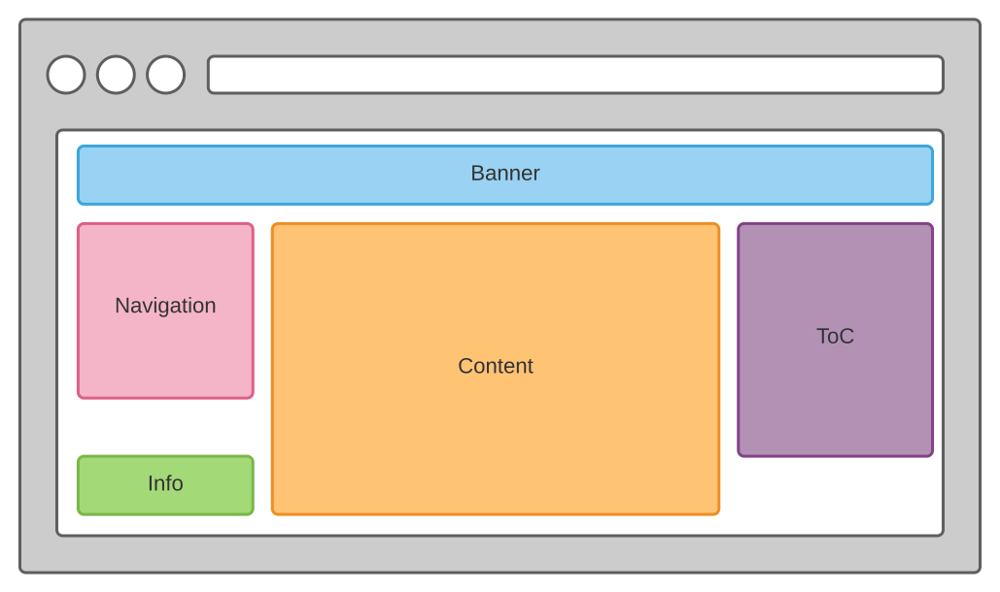

# jekyll-theme-corp

Corporate Jekyll theme! 

Corp is a Jekyll theme for GitHub Pages. You can [preview the theme to see what it looks like](https://rvr06.github.io/jekyll-theme-corp/)

## Layout



## How to use

1. Within your repository, create a `docs` folder to host your `Jekyll` site content.
1. Setup `GitHub Pages` accordingly
    
1. Create a `_config.yml` within, with at least:
    ```yml
    remote_theme: RVR06/jekyll-theme-corp

    plugins:
    - jekyll-remote-theme 
    ```
1. Specify `Jekyll` layout for every pages (but the main one, `README.md` or `index.md`), we want to be discoverable from the `navigation` panel:
    ```md
    ---
    layout: page
    title: xxx
    ---
    ```
